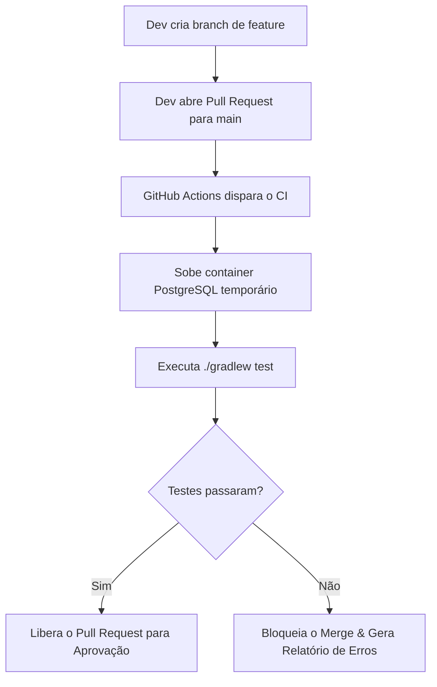

# Estratégia de Testes e Integração Contínua (CI)

Este documento descreve a arquitetura e convenção de testes adotada no projeto, bem como seu vínculo com o pipeline de Integração Contínua (**CI**) via **GitHub Actions**.

---

## 🎯 1. Objetivo
Garantir a qualidade, estabilidade e integridade da aplicação por meio de testes automáticos. Nenhum código deve ser integrado à branch principal (`main`) sem antes passar pela validação automatizada no pipeline de CI.

---

## 📁 2. Estrutura e Organização dos Testes

Os testes automatizados do backend estão localizados no diretório:
`backend/src/test/java/com/biblioteca/backend/`

A estrutura de pacotes espelha a arquitetura em camadas da aplicação:

```text
backend/src/test/java/com/biblioteca/backend/
├── BackendApplicationTests.java    # Teste de carregamento do contexto Spring
├── controller/                      # Testes das APIs / Endpoints HTTP (MockMvc)
├── service/                         # Testes das regras de negócio (Unitários com Mockito)
└── repository/                      # Testes de persistência e integração com o Banco
```

> ⚠️ **Regra de Nomenclatura:** Para que o Gradle identifique e execute os testes automaticamente, as classes de teste **devem terminar rigorosamente com a palavra `Test` ou `Tests`** (ex: `AlunoServiceTest.java`).

---

## 🧪 3. Ferramentas e Tipos de Teste

1. **Testes Unitários de Serviço (`service/`)**:
   - **Foco:** Validar regras de negócio de forma isolada.
   - **Ferramentas:** JUnit 5 e Mockito (`@Mock`, `@InjectMocks`).
   - **Execução:** Não depende de banco de dados real, executando de forma rápida.

2. **Testes de Integração e Web (`controller/` e `repository/`)**:
   - **Foco:** Validar respostas HTTP, DTOs, validações (`@Valid`) e consultas ao banco.
   - **Ferramentas:** Spring Boot Test (`@WebMvcTest`, `@SpringBootTest`, `MockMvc`).

---

## ⚙️ 4. Vinculação com o Pipeline de CI (GitHub Actions)

A automação de testes está configurada no arquivo [.github/workflows/ci.yml](file:///Users/marcosvinicius/Desktop/codigos/faculdade/trabalho_software_engineer/.github/workflows/ci.yml).

### 🔄 Fluxo de Trabalho (Workflow):



### 🛠️ O que acontece durante o CI?
1. **Disparo Automático:** O pipeline é acionado automaticamente quando um desenvolvedor abre ou atualiza um **Pull Request** direcionado à branch `main`.
2. **Ambiente de Banco Isolado:** O GitHub Actions inicializa um serviço containerizado de **PostgreSQL** idêntico ao ambiente de produção/desenvolvimento.
3. **Execução Automatizada:** O comando `./gradlew test` é executado dentro do container da aplicação.
4. **Proteção de Código:** Se qualquer teste falhar, o GitHub marca o PR com erro e **bloqueia a mesclagem (merge)** com a `main`.
5. **Relatórios de Falha:** Caso ocorra alguma falha, os relatórios detalhados em HTML gerados pelo Gradle são salvos automaticamente como artefatos da execução para análise.

---

## 💻 5. Guia Rápido para Desenvolvedores

### Rodando os testes localmente antes de abrir um PR:
Navegue até a pasta `backend` e execute:

```bash
# Executar todos os testes
./gradlew test

# Executar uma classe de teste específica
./gradlew test --tests AlunoServiceTest
```

### Boas Práticas:
- **Testar novas funcionalidades:** Ao criar um novo serviço ou controller, crie a respectiva classe de teste no pacote correspondente.
- **Não commitar testes quebrados:** Certifique-se de que `./gradlew test` executa com sucesso localmente antes de realizar o `push`.
